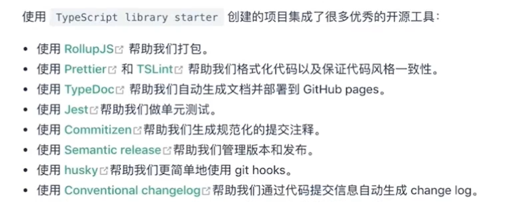

## Create project
Use TypeScript library starter(https://github.com/alexjoverm/typescript-library-starter)

## Scripts
- npm run commit

## Project Structure

目录与 Axios 基本保持一致，
- core 是 Axios 类的核心代码。
- adapters 是 XHR 核心实现，
- Cancel 是与 取消请求相关的代码。
- helpers 用于放常用的工具函数。
- Karma.conf.js 及 test 目录与单元测试相关。
- .travis.yml 用于配置 在线持续集成，